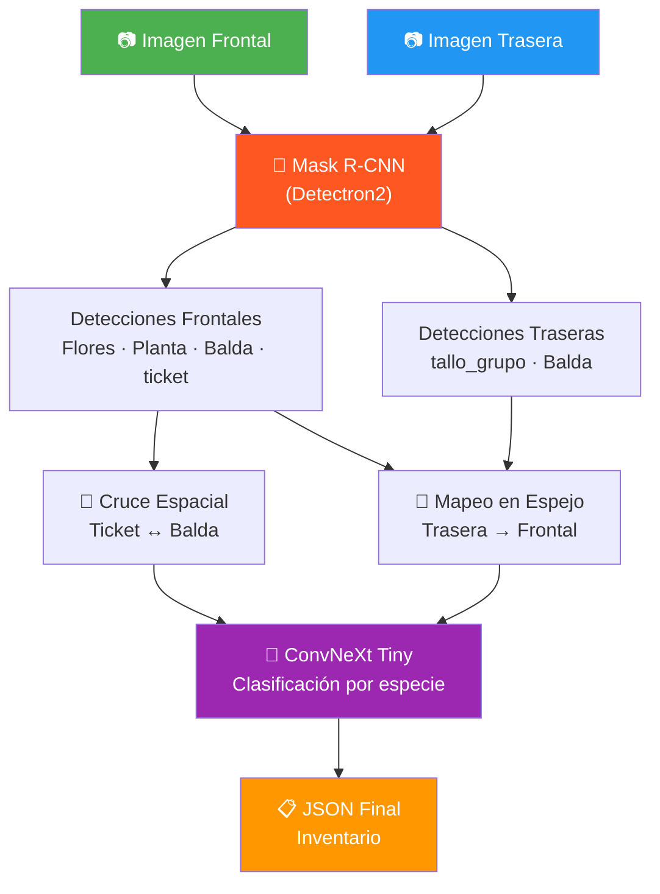
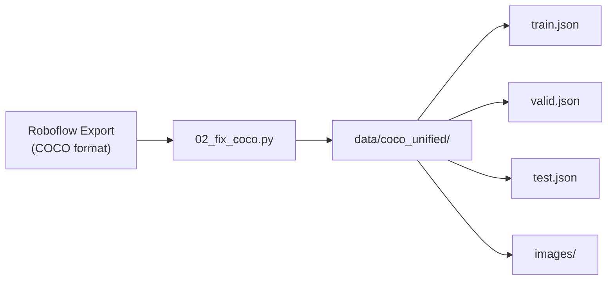
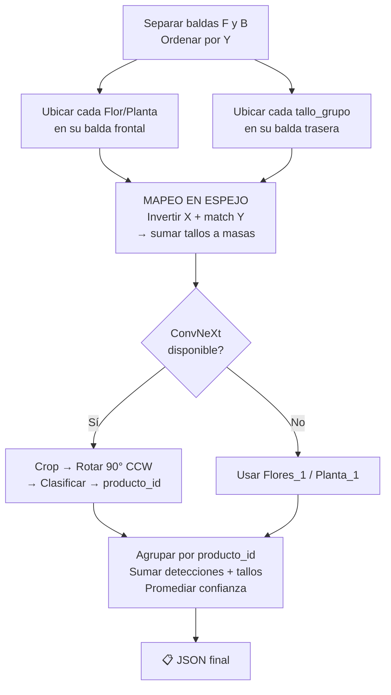
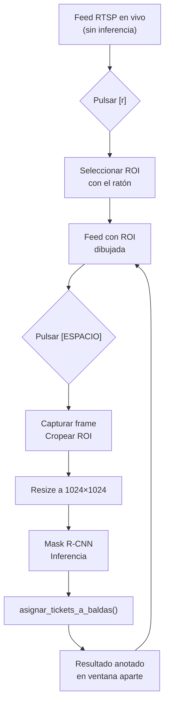

# 🌸 Proyecto H — Túnel de Flores

**Sistema de visión artificial para detección, clasificación y conteo automático de plantas y flores en carros logísticos.**

[](https://python.org)
[](https://pytorch.org)
[](https://github.com/facebookresearch/detectron2)
[](https://streamlit.io)

*Desarrollado en Verdnatura · 2026*

---

## 📋 Índice

1. [Descripción del proyecto](#-descripción-del-proyecto)
2. [Arquitectura del sistema](#-arquitectura-del-sistema)
3. [Estructura del repositorio](#-estructura-del-repositorio)
4. [Requisitos e instalación](#-requisitos-e-instalación)
5. [Pipeline de datos](#-pipeline-de-datos)
6. [Scripts — Referencia completa](#-scripts--referencia-completa)
7. [Configuración de Mask R-CNN](#-configuración-de-mask-r-cnn)
8. [Configuración de ConvNeXt](#-configuración-de-convnext)
9. [Config Manager](#-config-manager)
10. [Aplicación web (Streamlit)](#-aplicación-web-streamlit)
11. [Detección en tiempo real](#-detección-en-tiempo-real)
12. [Workflow de uso](#-workflow-de-uso)

---

## 🎯 Descripción del proyecto

El sistema fotografía **carros de plantas** desde dos ángulos:

| Vista | Qué se ve | Ejemplo |
|-------|-----------|---------| 
| **Frontal (F)** | Baldas, tickets de pedido, flores y plantas | `99F.png` |
| **Trasera (B)** | Tallos que sobresalen por detrás | `99B.png` |

A partir de ambas imágenes, el sistema ejecuta 5 fases:

| Fase | Modelo / Lógica | Resultado |
|------|----------------|-----------|
| 1️⃣ Detección | **Mask R-CNN** | Segmenta 5 clases: `Flores`, `Planta`, `Balda`, `ticket`, `tallo_grupo` |
| 2️⃣ Asignación | Cruce espacial (posición Y) | Cada `ticket` se vincula a las `Balda` que domina |
| 3️⃣ Conteo | Mapeo en espejo (Flip X) | Tallos traseros se cruzan con masas frontales |
| 4️⃣ Clasificación | **ConvNeXt Tiny** | Cada flor/planta recibe su `producto_id` |
| 5️⃣ Output | Agrupación | JSON final con inventario por ticket, balda y producto |

### Ejemplo de JSON de salida

```json
{
  "Items": {
    "Ticket_1": {
      "Balda_2": {
        "143992": {
          "tipo": "flores",
          "detecciones": 2,
          "tallos_totales": 2,
          "unidades_totales": 2,
          "confianza_media": 0.927
        }
      }
    }
  }
}
```

---

## 🏗️ Arquitectura del sistema



---

## 📁 Estructura del repositorio

```
py_PROYECTO_H/
│
├── configs/                                    ⚙️ Configuraciones YAML
│   ├── config1.yaml                            Config Mask R-CNN
│   ├── config_convnext.yaml                    Config ConvNeXt
│   └── config_manager.py                       Parser YAML → Detectron2
│
├── scripts/                                    🔧 Pipeline (organizado por fase)
│   ├── 01-preprocesing/                        Preprocesado de datos
│   │   ├── 01_cropping.py                      Extrae crops para clasificación
│   │   ├── 02_fix_coco.py                      Roboflow → COCO unificado
│   │   └── 03_upload_to_roboflow.py            Subida de crops a Roboflow
│   │
│   ├── 02-model_training/                      Entrenamiento de modelos
│   │   ├── 01_train_maskrcnn.py                Entrenamiento Mask R-CNN
│   │   └── 02_train_convnext.py                Entrenamiento ConvNeXt
│   │
│   ├── 03-model_eval/                          Evaluación de modelos
│   │   ├── 01_eval_maskrcnn.py                 Evaluación Mask R-CNN (COCO AP)
│   │   └── 02_eval_convnext.py                 Evaluación ConvNeXt (accuracy, CM)
│   │
│   ├── 04-real_time_detection/                 Detección en tiempo real
│   │   └── 00_single_cam_tests.py              Mask R-CNN + cámara RTSP
│   │
│   └── 05-logica_conteo_tallos/                Lógica de conteo
│       ├── 05_conteo.py                        Pipeline completo de conteo
│       └── conteo_module.py                    Wrapper de importación
│
├── test_area/                                  🖥️ Aplicación y tests
│   ├── app.py                                  Streamlit (3 módulos)
│   └── conexion_camaras_test.py                Test RTSP + YOLOv8
│
├── documentation/                              📖 Documentación del proyecto
│   ├── REGLAS_CONTEO.md                        Reglas A01-A07, B01-B09
│   ├── WORKFLOW.md                             Flujo de trabajo paso a paso
│   └── guion-clase.md                          Guion para presentación
│
├── exports/                                    📦 Archivos para despliegue
│   ├── requirements.txt                        Dependencias Python
│   ├── installation.txt                        Guía de instalación rápida
│   └── download_models.py                      Descarga modelos desde HuggingFace
│
├── data/                                       📊 Datasets (no versionado)
├── models/                                     🧠 Modelos entrenados (no versionado)
├── outputs/                                    📁 Salidas de evaluación y capturas
├── .gitignore
└── README.md
```

> **Nota:** `data/`, `models/` y `outputs/` se excluyen de Git por su tamaño.

---

## 🛠️ Requisitos e instalación

### Hardware

| Componente | Mínimo | Recomendado |
|-----------|--------|-------------|
| GPU | NVIDIA con CUDA | RTX 3060+ |
| VRAM | 6 GB | 8+ GB |
| RAM | 16 GB | 32 GB |
| Disco | 30 GB | 50 GB |

### Dependencias principales

| Paquete | Versión | Uso |
|---------|---------|-----|
| Python | >= 3.10 | Runtime |
| PyTorch | >= 2.0 + CUDA | Backbone de ambos modelos |
| Detectron2 | Latest | Mask R-CNN (segmentación) |
| timm | >= 0.9 | ConvNeXt Tiny (clasificación) |
| torchvision | Match PyTorch | Transforms y datasets |
| OpenCV | 4.x (con GUI) | Procesamiento de imágenes |
| Streamlit | Latest | Aplicación web |
| scikit-learn | Latest | Métricas de evaluación |
| PyYAML | Latest | Configs |
| ultralytics | Latest | YOLOv8 (test de cámaras) |

### Instalación rápida

```bash
# Clonar
git clone https://github.com/alexdme1/py_PROYECTO_H.git
cd py_PROYECTO_H

# Instalar dependencias
pip install -r exports/requirements.txt

# Instalar Detectron2 (requiere compilación)
pip install git+https://github.com/facebookresearch/detectron2.git

# Descargar modelos entrenados desde HuggingFace
python exports/download_models.py
```

> Para instrucciones más detalladas, consultar `exports/installation.txt`.

---

## 🔄 Pipeline de datos



**Transformaciones de `02_fix_coco.py`:**

- Rota todas las imágenes **90° CCW** (paisaje → retrato)
- Rota bounding boxes y segmentaciones poligonales
- Unifica categorías dispersas (ver tabla)
- Genera un JSON separado por split

### Clases del modelo

| ID | Clase | Descripción |
|----|-------|-------------|
| 0 | `Flores` | 🌸 Masas de flores (vista frontal) |
| 1 | `ticket` | 🏷️ Etiquetas de pedido |
| 2 | `Balda` | 📏 Estantes del carro |
| 3 | `Planta` | 🌿 Plantas en maceta |
| 4 | `tallo_grupo` | 🌾 Grupos de tallos (vista trasera) |

### Unificación de categorías

| Nombre en Roboflow | ID final | Nombre final |
|---------------------|----------|-------------|
| `Flores` | 0 | `Flores` |
| `0` | 1 | `ticket` |
| `Balda`, `Balda1`, `Balda2`, `Balda3` | 2 | `Balda` |
| `Planta` | 3 | `Planta` |
| `tallo_grupo` | 4 | `tallo_grupo` |

---

## 📜 Scripts — Referencia completa

### 📂 `01-preprocesing/` — Preprocesado de datos

---

#### `01_cropping.py` — Extracción de crops

Recorta bounding boxes de `Flores` y `Planta` para crear el dataset de clasificación por especie.

**Configuración:**

| Parámetro | Valor | Descripción |
|-----------|-------|-------------|
| `ROBOFLOW_DIR` | `data/Proyecto_H.v4i.coco(no_aug)/` | Export Roboflow (sin augmentation) |
| `TARGET_CATEGORY_NAMES` | `{"Flores", "Planta"}` | Clases a recortar |
| `MIN_CROP_SIZE` | `10 px` | Descarta crops muy pequeños |

**Salida:** `data/crops_clasificacion/{Flores,Planta}/*.png`

---

#### `02_fix_coco.py` — Unificador de datasets

Convierte exports de Roboflow en un dataset COCO limpio y unificado.

**Funciones:**

| Función | Descripción |
|---------|-------------|
| `to_float()` | Conversión segura a float |
| `process_bbox()` | Valida bbox `[x, y, w, h]` |
| `process_segmentation()` | Valida polígonos de segmentación (mín. 3 puntos) |
| `fix_and_merge_dataset()` | Pipeline completo: Roboflow → rota → remapea → COCO unificado |

---

#### `03_upload_to_roboflow.py` — Subida a Roboflow

Sube crops clasificados a Roboflow para crear datasets anotados.

> **API Key:** Se lee de variable de entorno. Configurar con:
> ```bash
> export ROBOFLOW_API_KEY="tu_api_key"
> ```

---

### 📂 `02-model_training/` — Entrenamiento

---

#### `01_train_maskrcnn.py` — Entrenamiento Mask R-CNN

Entrena un **Mask R-CNN** con backbone **ResNet-50 FPN** para segmentación de instancias.

**Arquitectura base:** `mask_rcnn_R_50_FPN_3x` (pretrained COCO → fine-tuned)

**Clase `CustomEvaluatorTrainer`** (extiende `DefaultTrainer`):

| Método | Descripción |
|--------|-------------|
| `build_evaluator()` | Inyecta `COCOEvaluator` para evaluación periódica durante el entrenamiento |
| `build_train_loader()` | DataLoader con augmentaciones extra (brillo, contraste, flips) leídas del YAML |

**Función `main()`:**

1. Lee `config1.yaml` y aplica parámetros al `cfg` de Detectron2
2. Registra datasets COCO (`flores_train`, `flores_valid`, `flores_test`)
3. Configura solver, anchors, RPN, ROI heads
4. Entrena con checkpoints periódicos
5. Evaluación final en test
6. Guarda modelo en `models/maskrcnn/{run_name}/`

---

#### `02_train_convnext.py` — Entrenamiento ConvNeXt

Entrena un **ConvNeXt Tiny** para clasificación de especies vegetales.

**Arquitectura:** `convnext_tiny.fb_in22k` (pretrained ImageNet-22K → fine-tuned)

**Funciones:**

| Función | Descripción |
|---------|-------------|
| `load_config()` | Carga `config_convnext.yaml` |
| `build_transforms()` | Augmentaciones train (flip, rotación, color jitter, random erasing) + preprocesamiento val |
| `FilteredImageFolder` | `ImageFolder` que excluye carpetas no deseadas (ej. `borrar`) |
| `build_dataloaders()` | DataLoaders con splits train/val/test |
| `build_model()` | ConvNeXt Tiny vía `timm`. Opción `FREEZE_BACKBONE` para solo entrenar cabeza |
| `build_scheduler()` | Cosine Annealing con warmup lineal |
| `train_one_epoch()` | Loop de training con logging a TensorBoard |
| `evaluate()` | Evaluación: loss + accuracy |
| `main()` | Orquesta entrenamiento completo |

**Archivos de salida** (en `models/convnext/{run_name}/`):

| Archivo | Descripción |
|---------|-------------|
| `best_model.pth` | Mejor validación accuracy |
| `model_final.pth` | Modelo al final del entrenamiento |
| `class_names.txt` | Clases en orden del modelo |
| `config_used.yaml` | Config usada (reproducibilidad) |
| `events.out.tfevents.*` | Logs de TensorBoard |

---

### 📂 `03-model_eval/` — Evaluación

---

#### `01_eval_maskrcnn.py` — Evaluación Mask R-CNN

Evalúa un modelo entrenado con métricas COCO estándar (AP, AP50, AP75) y genera visualizaciones filtradas.

| Parámetro | Descripción |
|-----------|-------------|
| `model_path` | Ruta al `.pth` del modelo |
| `min_area` | Área mínima de máscara en píxeles para dibujar (default: 5000) |

---

#### `02_eval_convnext.py` — Evaluación ConvNeXt

Evaluación detallada del clasificador. Genera:

- Accuracy global y por clase
- Classification report completo (precision, recall, F1)
- Matriz de confusión (PNG)
- Imágenes de errores de clasificación (análisis visual)

---

### 📂 `04-real_time_detection/` — Detección en tiempo real

---

#### `00_single_cam_tests.py` — Mask R-CNN en cámara RTSP

Conecta a una cámara Hikvision por RTSP y ejecuta Mask R-CNN bajo demanda.

**Flujo:**

1. Muestra el feed en vivo de la cámara (sin inferencia)
2. `[r]` → Seleccionar ROI con el ratón (zona del carro a analizar)
3. `[ESPACIO]` → Captura el frame actual, cropea la ROI, reescala a 1024×1024 y ejecuta Mask R-CNN + `asignar_tickets_a_baldas()`
4. Resultado anotado en ventana aparte con bboxes coloreadas + panel de asignación

**Controles:**

| Tecla | Acción |
|-------|--------|
| `r` | Seleccionar ROI (zona de detección) |
| `ESPACIO` | Capturar + detectar en la ROI |
| `s` | Guardar última captura como PNG |
| `c` | Cerrar ventana de resultados |
| `q` | Salir |

---

### 📂 `05-logica_conteo_tallos/` — Lógica de conteo

---

#### `05_conteo.py` — ⭐ Pipeline completo de conteo

Script principal. Ejecuta detección + clasificación + conteo y genera el JSON de inventario.

**Variables de configuración** (bloque `__main__`):

| Variable | Descripción |
|----------|-------------|
| `MRCNN_MODEL_PATH` | Ruta al `.pth` de Mask R-CNN |
| `SCORE_THRESH` | Umbral de confianza (default: 0.10) |
| `CONVNEXT_RUN_DIR` | Carpeta del run de ConvNeXt |
| `CONVNEXT_MODEL_PATH` | Ruta al `.pth` de ConvNeXt |
| `IMAGE_FRONTAL_PATH` | Imagen frontal de prueba |
| `IMAGE_TRASERA_PATH` | Imagen trasera de prueba |

**Lógica de `contar_articulos()`:**



Reglas implementadas: **A01-A07** (asignación ticket→balda) y **B01-B09** (conteo bidireccional). Documentación completa en `documentation/REGLAS_CONTEO.md`.

---

#### `conteo_module.py` — Wrapper de importación

Permite importar funciones de `05_conteo.py` en otros scripts (app, detección RT) sin ejecutar el bloque `__main__`.

**Funciones exportadas:**
- `asignar_tickets_a_baldas()`
- `procesar_pareja_imagenes()`
- `contar_articulos()`

---

### 📂 `test_area/` — Aplicación y tests de cámara

---

#### `conexion_camaras_test.py` — Test RTSP + YOLOv8

Test de conectividad con cámaras Hikvision. Usa **YOLOv8 nano** (pesos COCO) para detección de personas en tiempo real sobre el feed RTSP. Útil para verificar que la cámara está accesible antes de usar Mask R-CNN.

---

## ⚙️ Configuración de Mask R-CNN

Archivo: `configs/config1.yaml`

### Información del modelo

| Parámetro | Valor | Descripción |
|-----------|-------|-------------|
| `SUFIJO_VERSION` | `"_anchors_v4_hope"` | Sufijo para el nombre del run |
| `OUTPUT_DIR_BASE` | `"models/maskrcnn"` | Carpeta base de salida |
| `BASE_WEIGHTS_YAML` | `"mask_rcnn_R_50_FPN_3x.yaml"` | Arquitectura base (pretrained COCO) |

### Anchors — Cómo escanea la red

```yaml
ANCHOR_GENERATOR:
  SIZES: [[16, 32], [32, 64], [64, 128], [128, 256], [256, 512]]
  ASPECT_RATIOS: [[0.25, 0.5, 1.0, 2.5, 4.0]]
```

| Parámetro | Qué controla |
|-----------|-------------|
| `SIZES` | Tamaños de anclas en cada nivel del FPN (5 niveles). Anclas pequeñas → tallos; grandes → baldas |
| `ASPECT_RATIOS` | Proporciones ancho/alto. `0.25` = muy horizontal (baldas), `4.0` = muy vertical (tallos) |

### RPN — Region Proposal Network

| Parámetro | Valor | Descripción |
|-----------|-------|-------------|
| `NMS_THRESH` | `0.65` | IoU para suprimir propuestas duplicadas |
| `POST_NMS_TOPK_TRAIN` | `2000` | Máx propuestas tras NMS (training) |
| `POST_NMS_TOPK_TEST` | `2000` | Máx propuestas tras NMS (test) |

### ROI Heads — Clasificación final

| Parámetro | Valor | Descripción |
|-----------|-------|-------------|
| `NUM_CLASSES` | `5` | Flores, ticket, Balda, Planta, tallo_grupo |
| `BATCH_SIZE_PER_IMAGE` | `512` | Regiones evaluadas por imagen (calidad vs velocidad) |
| `NMS_THRESH_TEST` | `0.65` | NMS en detecciones finales |
| `SCORE_THRESH_TEST` | `0.20` | Confianza mínima para aceptar una detección |

### Solver — Entrenamiento

| Parámetro | Valor | Descripción |
|-----------|-------|-------------|
| `IMS_PER_BATCH` | `2` | Batch size (limitado por VRAM) |
| `BASE_LR` | `0.00025` | Learning rate |
| `MAX_ITER` | `28000` | Iteraciones totales (~12-14 epochs) |
| `STEPS` | `[18000, 24000]` | LR decay ×0.1 en estos puntos |
| `WARMUP_ITERS` | `1000` | Warmup lineal |
| `WEIGHT_DECAY` | `0.0005` | Regularización L2 |

### Data Augmentation

| Parámetro | Valor | Descripción |
|-----------|-------|-------------|
| `MIN_SIZE_TRAIN` | `[1000, 1080, 1150]` | Multi-scale training |
| `MAX_SIZE_TRAIN` | `2000` | Lado largo máximo |
| `RANDOM_FLIP` | `"horizontal"` | Flip horizontal aleatorio |
| `BRILLO_MIN / MAX` | `0.7 / 1.1` | Rango variación de brillo |
| `PROBABILIDAD` | `0.50` | Probabilidad de aplicar augmentation extra |

---

## ⚙️ Configuración de ConvNeXt

Archivo: `configs/config_convnext.yaml`

### Modelo

| Parámetro | Valor | Descripción |
|-----------|-------|-------------|
| `NAME` | `"convnext_tiny.fb_in22k"` | Pretrained ImageNet-22K |
| `NUM_CLASSES` | `null` (auto) | Auto-detectado del dataset |
| `PRETRAINED` | `true` | Usar pesos pre-entrenados |
| `FREEZE_BACKBONE` | `false` | `true` = solo entrena la cabeza |
| `EXCLUDE_CLASSES` | `["borrar"]` | Clases a ignorar del dataset |

### Dataset

| Parámetro | Valor | Descripción |
|-----------|-------|-------------|
| `ROOT` | `"data/Proyecto_H_clas.v1i.folder"` | Carpeta ImageFolder |
| `IMG_SIZE` | `224` | Resolución de entrada |
| `BATCH_SIZE` | `16` | Imágenes por batch |
| `NUM_WORKERS` | `4` | Workers para carga paralela |

### Training

| Parámetro | Valor | Descripción |
|-----------|-------|-------------|
| `EPOCHS` | `30` | Épocas totales |
| `OPTIMIZER` | `"AdamW"` | Optimizador |
| `LR` | `0.0001` | Learning rate |
| `WEIGHT_DECAY` | `0.01` | Regularización |
| `SCHEDULER` | `"cosine"` | Cosine Annealing |
| `WARMUP_EPOCHS` | `3` | Épocas de warmup lineal |
| `LABEL_SMOOTHING` | `0.1` | Suavizado de etiquetas |

---

## 🔧 Config Manager

Archivo: `configs/config_manager.py`

Puente entre el YAML legible y la estructura `CfgNode` rígida de Detectron2.

**Funciones:**

| Función | Descripción |
|---------|-------------|
| `parse_yaml_config(path)` | Lee YAML → devuelve dict Python |
| `apply_custom_config_to_cfg(cfg, data)` | Mapea cada sección del dict a campos de Detectron2 `cfg` |

**Secciones que mapea:**

| YAML | Detectron2 cfg |
|------|----------------|
| `MODEL.ANCHOR_GENERATOR` | `cfg.MODEL.ANCHOR_GENERATOR.SIZES / ASPECT_RATIOS` |
| `MODEL.RPN` | `cfg.MODEL.RPN.NMS_THRESH / POST_NMS_TOPK_*` |
| `MODEL.ROI_HEADS` | `cfg.MODEL.ROI_HEADS.NUM_CLASSES / SCORE_THRESH_TEST / ...` |
| `MODEL.ROI_BOX_HEAD` | `cfg.MODEL.ROI_BOX_HEAD.NAME / NUM_FC / NUM_CONV` |
| `INPUT` | `cfg.INPUT.MIN_SIZE_TRAIN / MAX_SIZE_* / RANDOM_FLIP` |
| `SOLVER` | `cfg.SOLVER.BASE_LR / MAX_ITER / STEPS / ...` |
| `DATALOADER` | `cfg.DATALOADER.NUM_WORKERS / SAMPLER_TRAIN` |
| `TEST` | `cfg.TEST.EVAL_PERIOD / DETECTIONS_PER_IMAGE` |

---

## 🖥️ Aplicación web (Streamlit)

Archivo: `test_area/app.py` — Tres módulos seleccionables:

### Módulo 1: Mask R-CNN (Segmentación)

- Selecciona **run** + **checkpoint** (.pth)
- Sube una imagen
- Visualiza detecciones con masks coloreadas

### Módulo 2: ConvNeXt (Clasificación)

- Selecciona **run** + **checkpoint** (.pth)
- Sube un crop de flor/planta
- Muestra especie predicha + top-5 con barras de confianza

### Módulo 3: Conteo (Pipeline completo)

- Selecciona modelos de **ambas redes** (Mask R-CNN + ConvNeXt)
- Sube par **Frontal + Trasera**
- Ejecuta pipeline completo
- Muestra detecciones visuales + JSON de inventario

### Lanzar la app

```bash
python test_area/app.py
# Abrir http://localhost:8501
```

---

## 📹 Detección en tiempo real

Archivo: `scripts/04-real_time_detection/00_single_cam_tests.py`

Conecta a una cámara **Hikvision** por RTSP y ejecuta Mask R-CNN bajo demanda sobre la zona seleccionada.

**Flujo de uso:**



> También disponible `test_area/conexion_camaras_test.py` con YOLOv8 nano para tests rápidos de conectividad.

---

## 🔁 Workflow de uso

### Entrenamiento completo (desde cero)

```bash
# 1. Preparar dataset (Roboflow → COCO unificado)
python scripts/01-preprocesing/02_fix_coco.py

# 2. Entrenar Mask R-CNN
python scripts/02-model_training/01_train_maskrcnn.py

# 3. Evaluar Mask R-CNN
python scripts/03-model_eval/01_eval_maskrcnn.py

# 4. Extraer crops para clasificación
python scripts/01-preprocesing/01_cropping.py

# 5. Entrenar ConvNeXt
python scripts/02-model_training/02_train_convnext.py

# 6. Evaluar ConvNeXt
python scripts/03-model_eval/02_eval_convnext.py

# 7. Conteo sobre un par de imágenes
python scripts/05-logica_conteo_tallos/05_conteo.py

# 8. Lanzar app web
python test_area/app.py
```

### Conteo rápido (modelos ya entrenados)

```bash
# Editar rutas de modelo en 05_conteo.py y ejecutar
python scripts/05-logica_conteo_tallos/05_conteo.py
```

### Detección en tiempo real (cámara RTSP)

```bash
python scripts/04-real_time_detection/00_single_cam_tests.py
```

---

*Proyecto H · Verdnatura · 2026*
