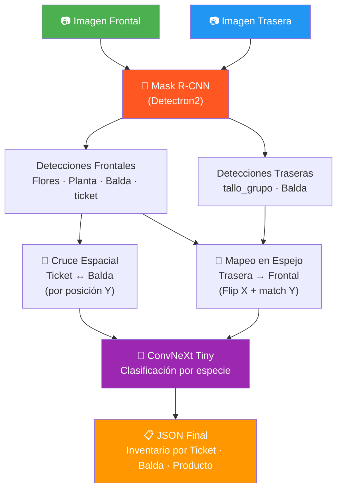
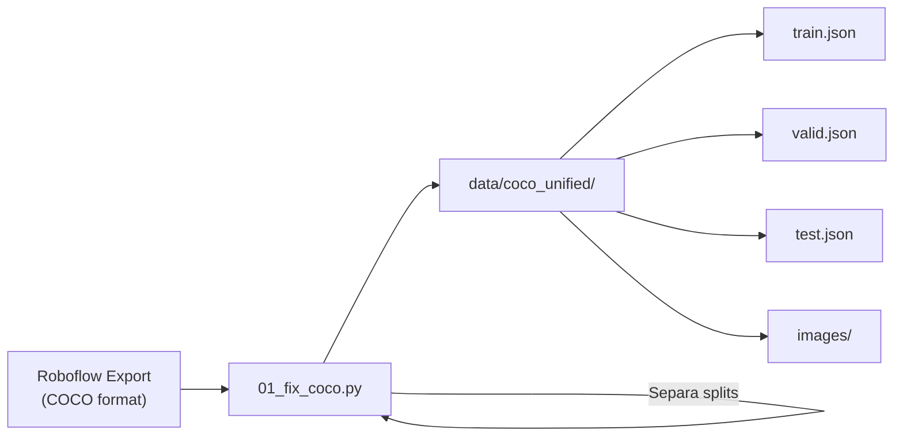
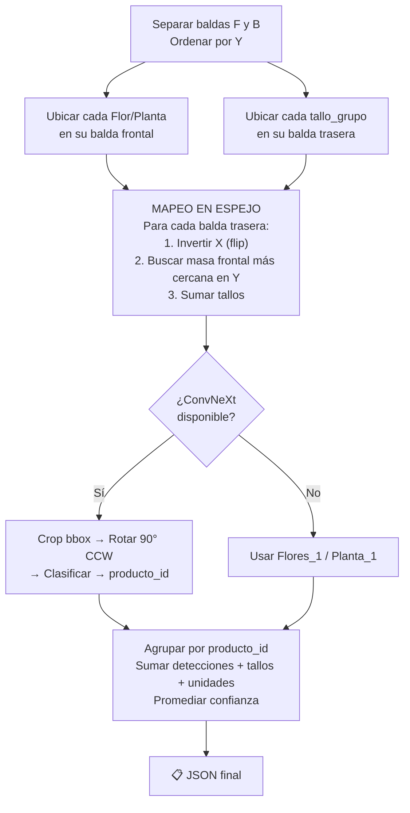

<](https://python.org)
[](https://pytorch.org)
[](https://github.com/facebookresearch/detectron2)
[](https://streamlit.io)

---

*Desarrollado en Verdnatura · 2026*

</div>

---

## 📋 Índice

1. [Descripción del proyecto](#-descripción-del-proyecto)
2. [Arquitectura del sistema](#-arquitectura-del-sistema)
3. [Estructura del repositorio](#-estructura-del-repositorio)
4. [Requisitos e instalación](#-requisitos-e-instalación)
5. [Pipeline de datos](#-pipeline-de-datos)
6. [Scripts — Referencia completa](#-scripts--referencia-completa)
7. [Configuración de Mask R-CNN](#-configuración-de-mask-r-cnn-config1yaml)
8. [Configuración de ConvNeXt](#-configuración-de-convnext-config_convnextyaml)
9. [Config Manager](#-config-manager-config_managerpy)
10. [Aplicación web (Streamlit)](#-aplicación-web-streamlit)
11. [Workflow de uso](#-workflow-de-uso)

---

## 🎯 Descripción del proyecto

El sistema fotografía **carros de plantas** desde dos ángulos:

| Vista | Qué se ve | Ejemplo |
|-------|-----------|---------|
| **Frontal (F)** | Baldas, tickets de pedido, flores y plantas | `99F.png` |
| **Trasera (B)** | Tallos que sobresalen por detrás | `99B.png` |

A partir de ambas imágenes, el sistema ejecuta 5 fases:

| Fase | Modelo / Lógica | Resultado |
|------|----------------|-----------|
| 1️⃣ Detección | **Mask R-CNN** | Segmenta 5 clases: `Flores`, `Planta`, `Balda`, `ticket`, `tallo_grupo` |
| 2️⃣ Asignación | Cruce espacial (posición Y) | Cada `ticket` se vincula a las `Balda` que domina |
| 3️⃣ Conteo | Mapeo en espejo (Flip X) | Tallos traseros se cruzan con masas frontales |
| 4️⃣ Clasificación | **ConvNeXt Tiny** | Cada flor/planta recibe su `producto_id` |
| 5️⃣ Output | Agrupación | JSON final con inventario por ticket, balda y producto |

### Ejemplo de JSON de salida

```json
{
    "Items": {
        "Ticket_1": {
            "Balda_2": {
                "143992": {
                    "tipo": "flores",
                    "detecciones": 2,
                    "tallos_totales": 2,
                    "unidades_totales": 2,
                    "confianza_media": 0.927
                },
                "99338": {
                    "tipo": "flores",
                    "detecciones": 1,
                    "tallos_totales": 1,
                    "unidades_totales": 1,
                    "confianza_media": 0.918
                }
            }
        }
    }
}
```

---

## 🏗️ Arquitectura del sistema



---

## 📁 Estructura del repositorio

```
py_PROYECTO_H/
│
├── 📂 configs/                         ⚙️ Configuraciones YAML
│   ├── config1.yaml                    Config Mask R-CNN
│   ├── config_convnext.yaml            Config ConvNeXt
│   └── config_manager.py              Parser YAML → Detectron2
│
├── 📂 scripts/                         🔧 Pipeline (ejecutar en orden numérico)
│   ├── 00_cropping.py                  Extrae crops para clasificación
│   ├── 00_trust_fix_coco.py            Verifica anotaciones visualmente
│   ├── 01_fix_coco.py                  Roboflow → COCO unificado
│   ├── 02_train_maskrcnn.py            Entrenamiento Mask R-CNN
│   ├── 03_eval_maskrcnn.py             Evaluación Mask R-CNN
│   ├── 04_seg_tickets.py              Cruce espacial (visual)
│   ├── 05_conteo.py                    Pipeline completo de conteo
│   ├── 06_conteo_masivo.py             Conteo en lote
│   ├── 07_train_convnext.py            Entrenamiento ConvNeXt
│   ├── 08_eval_convnext.py             Evaluación ConvNeXt
│   ├── conteo_module.py               Wrapper de importación
│   └── upload_to_roboflow.py           Subida de crops a Roboflow
│
├── 📂 test_area/                       🖥️ Aplicación web
│   ├── app.py                          Streamlit (3 módulos)
│   └── view_gt.py                      Visualizador ground truth
│
├── 📂 data/                            📊 Datasets (no versionado)
├── 📂 models/                          🧠 Modelos (no versionado, 19 GB)
├── .gitignore
├── WORKFLOW.md
└── README.md
```

> **Nota**: `data/` y `models/` se excluyen de Git por su tamaño. Los modelos se almacenan externamente.

---

## 🛠️ Requisitos e instalación

### Hardware

| Componente | Mínimo | Recomendado |
|-----------|--------|-------------|
| 🎮 GPU | NVIDIA con CUDA | NVIDIA RTX 3060+ |
| 💾 VRAM | 6 GB | 8+ GB |
| 🧮 RAM | 16 GB | 32 GB |
| 💿 Disco | 30 GB | 50 GB |

### Dependencias

| Paquete | Versión | Uso |
|---------|---------|-----|
| **Python** | ≥ 3.10 | Runtime |
| **PyTorch** | ≥ 2.0 + CUDA | Backbone de ambos modelos |
| **Detectron2** | Latest | Mask R-CNN (segmentación) |
| **timm** | ≥ 0.9 | ConvNeXt Tiny (clasificación) |
| **torchvision** | Matching PyTorch | Transforms y datasets |
| **OpenCV** | 4.x | Procesamiento de imágenes |
| **Streamlit** | Latest | Aplicación web |
| **scikit-learn** | Latest | Métricas de evaluación |
| **PyYAML** | Latest | Configs |

### Instalación rápida

```bash
# Clonar
git clone https://github.com/alexdme1/py_PROYECTO_H.git
cd py_PROYECTO_H

# Dependencias principales
pip install torch torchvision --index-url https://download.pytorch.org/whl/cu118
pip install detectron2 -f https://dl.fbaipublicfiles.com/detectron2/wheels/cu118/torch2.0/index.html
pip install timm streamlit scikit-learn pyyaml opencv-python matplotlib
```

---

## 🔄 Pipeline de datos



### Clases del modelo de segmentación

| ID | Clase | Icono | Descripción |
|----|-------|-------|-------------|
| 0 | `Flores` | 🌸 | Masas de flores visibles desde el frente |
| 1 | `ticket` | 🏷️ | Etiquetas de pedido en las baldas |
| 2 | `Balda` | 📏 | Estantes/niveles del carro |
| 3 | `Planta` | 🌿 | Plantas en maceta |
| 4 | `tallo_grupo` | 🌾 | Grupos de tallos (vista trasera) |

### Unificación de categorías (`01_fix_coco.py`)

| Nombre original Roboflow | → | ID final | Nombre final |
|--------------------------|---|----------|-------------|
| `Flores` | → | 0 | `Flores` |
| `0` | → | 1 | `ticket` |
| `Balda1`, `Balda2`, `Balda3` | → | 2 | `Balda` |
| `Planta` | → | 3 | `Planta` |
| `tallo_grupo` | → | 4 | `tallo_grupo` |

---

## 📜 Scripts — Referencia completa

### `00_cropping.py` — Extracción de crops

> Recorta bounding boxes de `Flores` y `Planta` para crear el dataset de clasificación por especie.

| Parámetro | Valor | Descripción |
|-----------|-------|-------------|
| `ROBOFLOW_DIR` | `data/Proyecto_H.v4i.coco(no_aug)/` | Export Roboflow sin augmentation |
| `TARGET_CATEGORY_NAMES` | `{"Flores", "Planta"}` | Clases a recortar |
| `MIN_CROP_SIZE` | `10 px` | Descarta crops muy pequeños (ruido) |

| Función | Descripción |
|---------|-------------|
| `process_split()` | Lee JSON COCO del split, extrae bboxes de las categorías objetivo, recorta, rota 90° CCW, y guarda |
| `main()` | Orquesta todos los splits y muestra estadísticas |

**Salida**: `data/crops_clasificacion/{Flores,Planta}/*.png`

---

### `00_trust_fix_coco.py` — Verificador visual

> Dibuja ground truth (bboxes + masks translúcidas) sobre N imágenes aleatorias para verificar el dataset.

| Función | Descripción |
|---------|-------------|
| `get_color_for_id()` | Color BGR único por categoría |
| `draw_ground_truth()` | Carga COCO JSON → dibuja bboxes + segmentaciones sobre imágenes → guarda visualizaciones |

---

### `01_fix_coco.py` — Unificador de datasets

> Convierte exports de Roboflow (nombres inconsistentes) en COCO limpio y unificado.

**Transformaciones:**

- ↻ Rota **todas las imágenes** 90° CCW
- 📐 Rota **bounding boxes** y **segmentaciones** poligonales
- 🔀 Unifica categorías: `Balda1/2/3 → Balda`, `0 → ticket`
- 📄 Genera **un JSON por split**

| Función | Descripción |
|---------|-------------|
| `to_float()` | Conversión segura a float |
| `process_bbox()` | Valida bbox `[x, y, w, h]` |
| `process_segmentation()` | Valida polígonos (mín. 3 puntos) |
| `fix_and_merge_dataset()` | Pipeline completo: Roboflow → rota → remapea → COCO |

---

### `02_train_maskrcnn.py` — Entrenamiento Mask R-CNN

> Entrena un Mask R-CNN con backbone ResNet-50 FPN para segmentación de instancias.

**Arquitectura**: `mask_rcnn_R_50_FPN_3x` (pretrained COCO → fine-tuned)

| Componente | Descripción |
|------------|-------------|
| **`CustomEvaluatorTrainer`** | Subclase de `DefaultTrainer` |
| `.build_evaluator()` | Inyecta `COCOEvaluator` para eval periódica |
| `.build_train_loader()` | DataLoader con augmentaciones extra (brillo, contraste) desde YAML |
| **`main()`** | Lee config YAML → registra dataset → entrena → evalúa → guarda modelo |

**Salida**: `models/maskrcnn/{run_name}/model_final.pth`

---

### `03_eval_maskrcnn.py` — Evaluación Mask R-CNN

> Evalúa con métricas COCO estándar (AP, AP50, AP75) y genera visualizaciones.

| Función | Descripción |
|---------|-------------|
| `main(model_path, min_area)` | Carga modelo → `COCOEvaluator` en test → visualizaciones filtradas por área mínima |

| Parámetro | Descripción |
|-----------|-------------|
| `min_area` | Área mínima de máscara en píxeles para dibujar (default: 5000). Elimina ruido |

---

### `04_seg_tickets.py` — Cruce espacial (versión visual)

> Versión visual del cruce ticket ↔ balda con dibujo de líneas y zonas coloreadas.

| Función | Descripción |
|---------|-------------|
| `asignar_tickets_a_baldas()` | Asigna tickets a baldas por posición Y. Cada ticket se expande a baldas adyacentes sin ticket propio |
| `procesar_pareja_imagenes()` | Traslada la asignación del espacio frontal al trasero |
| `contar_articulos()` | Cuenta Flores/Plantas por balda cruzando ambas vistas |
| `extract_detections()` | Convierte `outputs["instances"]` de Detectron2 a lista de dicts |

---

### `05_conteo.py` — ⭐ Pipeline completo de conteo

> Script principal. Ejecuta detección + clasificación + conteo. Genera el JSON de inventario.

#### Variables de configuración (líneas 375-390)

| Variable | Descripción |
|----------|-------------|
| `MRCNN_MODEL_PATH` | Ruta al `.pth` de Mask R-CNN |
| `SCORE_THRESH` | Umbral confianza (default: 0.10) |
| `CONVNEXT_RUN_DIR` | Carpeta del run ConvNeXt |
| `CONVNEXT_MODEL_PATH` | Ruta al `.pth` de ConvNeXt |
| `IMAGE_FRONTAL_PATH` | Imagen frontal de prueba |
| `IMAGE_TRASERA_PATH` | Imagen trasera de prueba |

#### Lógica de `contar_articulos()`



---

### `06_conteo_masivo.py` — Conteo en lote

> Mismo flujo que `05_conteo.py` pero **iterando sobre todos los pares** `{N}F.png` / `{N}B.png` en `data/dataset_final/`.

---

### `07_train_convnext.py` — Entrenamiento ConvNeXt

> Entrena ConvNeXt Tiny para clasificación de especies vegetales.

**Arquitectura**: `convnext_tiny.fb_in22k` (pretrained ImageNet-22K → fine-tuned)

| Función | Descripción |
|---------|-------------|
| `load_config()` | Carga `config_convnext.yaml` |
| `build_transforms()` | Augmentaciones train (flip, rotación, color jitter, erasing) + preprocesamiento val/test |
| `FilteredImageFolder` | `ImageFolder` que excluye carpetas de clases no deseadas (ej. `borrar`) |
| `build_dataloaders()` | DataLoaders con splits train/val/test |
| `build_model()` | ConvNeXt Tiny vía `timm`. Opción `FREEZE_BACKBONE` |
| `build_scheduler()` | Cosine Annealing con warmup lineal |
| `train_one_epoch()` | Loop de training con logging TensorBoard |
| `evaluate()` | Evaluación con loss y accuracy |
| `main()` | Orquesta todo el entrenamiento |

**Archivos de salida** (en `models/convnext/{run_name}/`):

| Archivo | Descripción |
|---------|-------------|
| `best_model.pth` | Mejor val accuracy |
| `model_final.pth` | Modelo al final |
| `class_names.txt` | Clases en orden del modelo |
| `config_used.yaml` | Config usada (reproducibilidad) |
| `events.out.tfevents.*` | Logs TensorBoard |

---

### `08_eval_convnext.py` — Evaluación ConvNeXt

> Evaluación detallada del clasificador.

**Genera:**

- ✅ Accuracy global y por clase
- 📊 Classification report (precision, recall, F1)
- 🔲 Matriz de confusión (PNG)
- ❌ Imágenes de errores (análisis visual)

---

### `conteo_module.py` — Wrapper de importación

> Permite importar funciones de `05_conteo.py` en la app Streamlit sin ejecutar `__main__`.

---

### `upload_to_roboflow.py` — Subida a Roboflow

> Sube crops clasificados a Roboflow para crear datasets anotados.

⚠️ **API Key**: Se lee de variable de entorno:
```bash
export ROBOFLOW_API_KEY="tu_api_key"
```

---

## ⚙️ Configuración de Mask R-CNN (`config1.yaml`)

### Información del modelo

| Parámetro | Valor | Descripción |
|-----------|-------|-------------|
| `SUFIJO_VERSION` | `"_anchors_v4_hope"` | Sufijo del nombre del run |
| `OUTPUT_DIR_BASE` | `"models/maskrcnn"` | Carpeta base de salida |
| `BASE_WEIGHTS_YAML` | `"mask_rcnn_R_50_FPN_3x.yaml"` | Arquitectura base |

### Anchors — Cómo escanea la red

```yaml
ANCHOR_GENERATOR:
    SIZES: [[16, 32], [32, 64], [64, 128], [128, 256], [256, 512]]
    ASPECT_RATIOS: [[0.25, 0.5, 1.0, 2.5, 4.0]]
```

| Parámetro | Qué controla |
|-----------|-------------|
| `SIZES` | Tamaños de anclas en cada nivel FPN. Pequeñas → tallos; Grandes → baldas |
| `ASPECT_RATIOS` | Proporciones. `0.25` = horizontal (baldas), `4.0` = vertical (tallos) |

### RPN — Region Proposal Network

| Parámetro | Valor | Descripción |
|-----------|-------|-------------|
| `NMS_THRESH` | `0.65` | IoU para suprimir propuestas duplicadas |
| `POST_NMS_TOPK_TRAIN` | `2000` | Máx propuestas tras NMS (training) |
| `POST_NMS_TOPK_TEST` | `2000` | Máx propuestas tras NMS (test) |

### ROI Heads — Clasificación final

| Parámetro | Valor | Descripción |
|-----------|-------|-------------|
| `NUM_CLASSES` | `5` | Flores, ticket, Balda, Planta, tallo_grupo |
| `BATCH_SIZE_PER_IMAGE` | `512` | Regiones evaluadas por imagen |
| `NMS_THRESH_TEST` | `0.65` | NMS en detecciones finales |
| `SCORE_THRESH_TEST` | `0.20` | Confianza mínima para aceptar |

### Solver — Entrenamiento

| Parámetro | Valor | Descripción |
|-----------|-------|-------------|
| `IMS_PER_BATCH` | `2` | Batch size (limitado por VRAM) |
| `BASE_LR` | `0.00025` | Learning rate base |
| `MAX_ITER` | `28000` | Iteraciones totales (~12-14 epochs) |
| `STEPS` | `[18000, 24000]` | LR decay ×0.1 en estos puntos |
| `WARMUP_ITERS` | `1000` | Warmup lineal |
| `WEIGHT_DECAY` | `0.0005` | Regularización L2 |

### Data Augmentation

| Parámetro | Valor | Descripción |
|-----------|-------|-------------|
| `MIN_SIZE_TRAIN` | `[1000, 1080, 1150]` | Multi-scale training |
| `MAX_SIZE_TRAIN` | `2000` | Lado largo máximo |
| `RANDOM_FLIP` | `"horizontal"` | Flip horizontal aleatorio |
| `BRILLO_MIN / MAX` | `0.7 / 1.1` | Rango de variación de brillo |
| `PROBABILIDAD` | `0.50` | Probabilidad de aplicar augmentation |

---

## ⚙️ Configuración de ConvNeXt (`config_convnext.yaml`)

### Modelo

| Parámetro | Valor | Descripción |
|-----------|-------|-------------|
| `NAME` | `"convnext_tiny.fb_in22k"` | Pretrained ImageNet-22K |
| `NUM_CLASSES` | `null` (auto) | Se detecta del dataset |
| `PRETRAINED` | `true` | Usar pesos pre-entrenados |
| `FREEZE_BACKBONE` | `false` | `true` = solo entrena la cabeza |
| `EXCLUDE_CLASSES` | `["borrar"]` | Clases a ignorar |

### Dataset

| Parámetro | Valor | Descripción |
|-----------|-------|-------------|
| `ROOT` | `"data/Proyecto_H_clas.v1i.folder"` | Carpeta ImageFolder |
| `IMG_SIZE` | `224` | Resolución de entrada |
| `BATCH_SIZE` | `16` | Imágenes por batch |
| `NUM_WORKERS` | `4` | Workers para carga de datos |

### Training

| Parámetro | Valor | Descripción |
|-----------|-------|-------------|
| `EPOCHS` | `30` | Épocas totales |
| `OPTIMIZER` | `"AdamW"` | Optimizador |
| `LR` | `0.0001` | Learning rate |
| `WEIGHT_DECAY` | `0.01` | Regularización |
| `SCHEDULER` | `"cosine"` | Cosine Annealing |
| `WARMUP_EPOCHS` | `3` | Épocas de warmup |
| `LABEL_SMOOTHING` | `0.1` | Suavizado de etiquetas |

---

## 🔧 Config Manager (`config_manager.py`)

> Puente entre el YAML legible y la estructura `CfgNode` rígida de Detectron2.

| Función | Descripción |
|---------|-------------|
| `parse_yaml_config(path)` | Lee YAML → devuelve dict Python |
| `apply_custom_config_to_cfg(cfg, data)` | Mapea cada sección del dict a campos de `cfg` de Detectron2 |

**Secciones que mapea:**

| YAML | → | Detectron2 `cfg` |
|------|---|-------------------|
| `MODEL.ANCHOR_GENERATOR` | → | `cfg.MODEL.ANCHOR_GENERATOR.SIZES/ASPECT_RATIOS` |
| `MODEL.RPN` | → | `cfg.MODEL.RPN.NMS_THRESH/POST_NMS_TOPK_*` |
| `MODEL.ROI_HEADS` | → | `cfg.MODEL.ROI_HEADS.NUM_CLASSES/SCORE_THRESH_TEST/...` |
| `INPUT` | → | `cfg.INPUT.MIN_SIZE_TRAIN/MAX_SIZE_*/RANDOM_FLIP` |
| `SOLVER` | → | `cfg.SOLVER.BASE_LR/MAX_ITER/STEPS/...` |
| `DATALOADER` | → | `cfg.DATALOADER.NUM_WORKERS/SAMPLER_TRAIN` |
| `TEST` | → | `cfg.TEST.EVAL_PERIOD/DETECTIONS_PER_IMAGE` |

---

## 🖥️ Aplicación web (Streamlit)

`test_area/app.py` — Tres módulos seleccionables:

### Módulo 1: Mask R-CNN (Segmentación)

- Selecciona **run** + **checkpoint**
- Sube una imagen
- Visualiza detecciones con masks coloreadas

### Módulo 2: ConvNeXt (Clasificación)

- Selecciona **run** + **checkpoint**
- Sube un crop de flor/planta
- Muestra especie predicha + top-5 con barras de confianza

### Módulo 3: Conteo (Pipeline completo)

- Selecciona modelos de **ambas redes**
- Sube par **Frontal + Trasera**
- Ejecuta pipeline completo
- Muestra detecciones visuales + **JSON de inventario**

### Lanzar

```bash
python test_area/app.py
# → http://localhost:8501
```

---

## 🔁 Workflow de uso

### Entrenamiento completo (desde cero)

```bash
# 1. Preparar dataset
python scripts/01_fix_coco.py

# 2. Verificar anotaciones
python scripts/00_trust_fix_coco.py

# 3. Entrenar segmentación
python scripts/02_train_maskrcnn.py

# 4. Evaluar segmentación
python scripts/03_eval_maskrcnn.py

# 5. Extraer crops para clasificación
python scripts/00_cropping.py

# 6. Entrenar clasificador
python scripts/07_train_convnext.py

# 7. Evaluar clasificador
python scripts/08_eval_convnext.py

# 8. Conteo sobre un par de imágenes
python scripts/05_conteo.py

# 9. App web
python test_area/app.py
```

### Conteo rápido (modelos ya entrenados)

```bash
# Editar MRCNN_MODEL_PATH y CONVNEXT_MODEL_PATH en scripts/05_conteo.py
python scripts/05_conteo.py
```

---

<div align="center">

**Proyecto H** · Verdnatura · 2026

</div>
]]>
